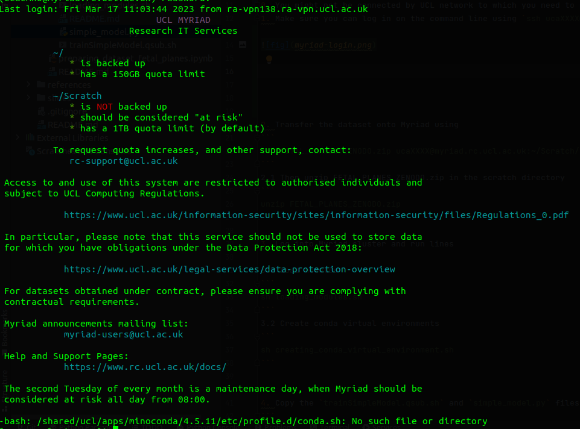

# AI/ML workflow for Myriad cluster
**Author(s):** Sofia Miñano [@sfmig](https://github.com/sfmig), Miguel Xochicale [@mxochicale](https://github.com/mxochicale), Harvey Mannering [@harveymannering](https://github.com/harveymannering)

## Background
"Myriad is designed for high I/O, high throughput jobs that will run within a single node rather than multi-node parallel jobs."
You need to have an UCL account to which you need to apply for a Myriad accounts the [Research Computing sign up process](https://www.rc.ucl.ac.uk/docs/Account_Services/).
See more details here https://www.rc.ucl.ac.uk/docs/Clusters/Myriad/

## Steps to run your AI pipeline in Myriad cluster
To setup up Myriad and run your jobs just follow the following steps.   

1. You might not be connected by UCL network to which you need to conect to the UCL VPN for your OS:
  * [Linux](https://www.ucl.ac.uk/isd/how-to/connecting-to-ucl-vpn-linux),
  * [Windows, macOS, etc](https://www.ucl.ac.uk/isd/services/get-connected/ucl-virtual-private-network-vpn)

2. Make sure you can log in on the command line using `ssh ucaXXXX@myriad.rc.ucl.ac.uk` where ucaXXXX is your UCL username. Then use `exit` to log out.


3. From a separate terminal, transfer the dataset and files onto Myriad cluster. Go the the path where your files and type
```
scp YOUR_DATASET.zip ucaXXXX@myriad.rc.ucl.ac.uk:~/Scratch/
```
Alternatively, you can download the dataset in your preferred path in the Myriad cluster
```
wget https://zenodo.org/record/3904280/files/YOUR_DATASET.zip 
```

3.1 Then unzip YOUR_DATASET.zip in the scratch directory
```
unzip YOUR_DATASET.zip
```

4. Clone repo in Myriad cluster and run lines
```
git clone git@github.com:dlcv-journal-club/TextToImageModels.git 
```

4.1 Load modules 
```
cd TextToImageModels/examples/myriad-guidelines/
source loading_modules.sh #REF1  
```
4.2 Create conda virtual environments
 
4.2.1 Open a new terminal to copy virtual environment
```
cd TextToImageModels/dependencies
```

4.2.2. Create your python virtual env as follows
```
# Create a new python virtual environment
python -m venv .
# Activate the new environment
source bin/activate
pip install torch torchvision open-clip-torch numpy matplotlib opencv-python wandb
pip install tqdm notebook jupyter seaborn scikit-image nibabel pillow datasets diffusers
pip install torchmetrics monai accelerate torch-fidelity
```

5. Submit, queue up, your job in the cluster
```
qsub trainSimpleModel.qsub.sh 
```

6. To check if your job has been correctly queued use:
```
qstat
```
which output might look like this
```
(ucaXXXX) [ucaXXXX@login12 Scratch]$ qstat
job-ID  prior   name       user         state submit/start at     queue                          slots ja-task-ID 
-----------------------------------------------------------------------------------------------------------------
 979761 0.00000 SimpleMode ccaemxo      qw    06/02/2023 10:53:02   
```

NB. If nothing appears, it means there has been a problem add your job to the queue.  
But  if a table of jobs is shown, it means you jobs has been queued.  
The state column tells you if you job is running.  
If it is set to 'qw', it is waiting in the queue.  
If it is set to 'r', it is running.

## Other useful commands 
* You can check both quotas on Myriad by running:
```
lquota
```


## References
* #REF1 `When you say source runit.sh, it’s like typing the module command directly into your interactive shell.`  
        `But when you say ./runit.sh, you are running a new, non-interactive shell.`
        https://unix.stackexchange.com/questions/194893/why-cant-i-load-modules-while-executing-my-bash-script-but-only-when-sourcing
